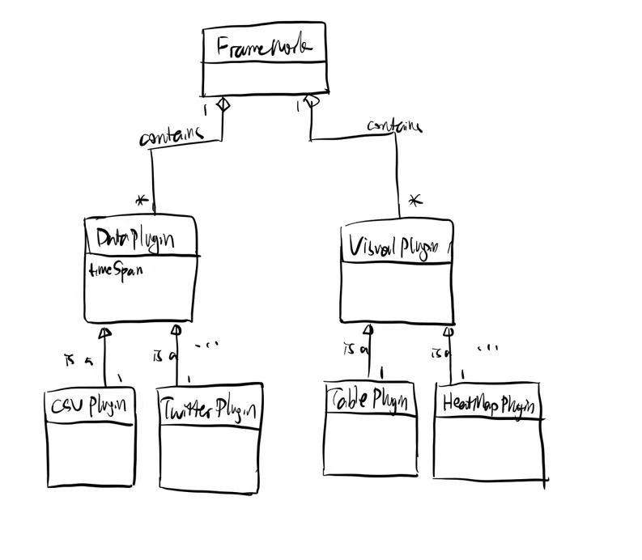

# Design Document

## Domain

The idea is provide a tool that can gather chronological data related to geography and maps, sorting the data in time order, and gathering them with geometry similarities, so that the difference of data related to geograph and their changes overtime could be visualized in an intuitive way. 

The framework's main jobs include sorting the data chronologically, dividing them by "time spans", and grouping and merging the data together with self-defined geology similarities.

This framework supports many real-world applications, from historic population migration to recent COVID distribution; from office locations of a company to geological environment changes over the world. 

### Supported Plugins
Two types of plugins are included in the framework: `Data Plugin`s and `Visualization Plugin`s. 

#### Data Plugins
`Data Plugin`s provide a way to convert a specific data source to the format that the framework could accept. To show chrnological changes while grouping data with geometrical similarities, the data passed into the framework should at least have the following fields: `time`, `geo-location` and `data` themselves. Meaning it should at least tell what the time it is, where the data are, and what's the value of the measurement.

Specifically, example plugins can be used to:
- CSV plugin that takes one or several CSV table and convert into the framework acceptable form
- Excel plugin that takes data from Microsoft Excel sheets
- Twitter pluginthat takes some generic Twitter messages

#### Visualization Plugins
The `Visual Plugin`s provide functionality to present the data in an intuitive way. They could include:

- A classic table that collects data and sort in chronological order;
- Geography heat map that displaying the change of density of the data from different locations over time;
- Several line charts, one for each place, showing the data changes over time for a specific place

## Generality vs Specificity

## Project Structure

### Organization of framework 
The project is divided into frontend and backend.

The frontend is a single-page web application frontend, possibly using `React` framework, giving users an GUI interface to choose importing data format (choose `Data Plugin`) and choose visualization styles (`Visual Plugin`). The frontend file structure depends on the framework (`React`, `Vue`, etc.) we choose to implement. 

The backend is a Java project that is responsible for building the core functionalities, providing plugin interfaces and using plugins. 

### Plugin organization and interface locations

Below is a tentative backend project structure: 
```
|-- src
  - Main.java (class)
  |-- framework
    |--core
      - Framework.java (interface)
      - FrameworkImpl.java (class)
      - DataPlugin.java (interface)
      - VisualPlugin.java (interface)
    |--gui
  |-- plugin
    |-- dataPlugin
      |-- plugin1Folder
      |-- plugin2Folder
      ...
    |-- visualPlugin
      |-- plugin1Folder
      |-- plugin2Folder
      ...
|-- resources
  |-- META-INF.services
    - plugins
```

For convinience, an object model is also shown as below:



### Key data structure
The key data structure used are java `List`s and `Map`s.

The `List`s are used to store the plugins. A `List` of `DataPlugin` and a `List` of `VisualPlugin` would be included, and when the framework starts these plugins would be registered and called when necessary.

The `Map` are used to store and group the data. Data with similar/same geology locations are grouped together by `Map` or `Set`. The `Map` keys can be time or geology locations. If Necessary a java `TreeMap` can be used to sort the keys in chrnological order. 


### Plugins loaded
The plugins are loaded using java `ServiceLoader`. The paths for the plugin classes will be stored in the `plugins` file under the `resources/META-INF.services` and would be registered using the java `ServiceLoader` in the `Main` class. 

## Plugin interfaces